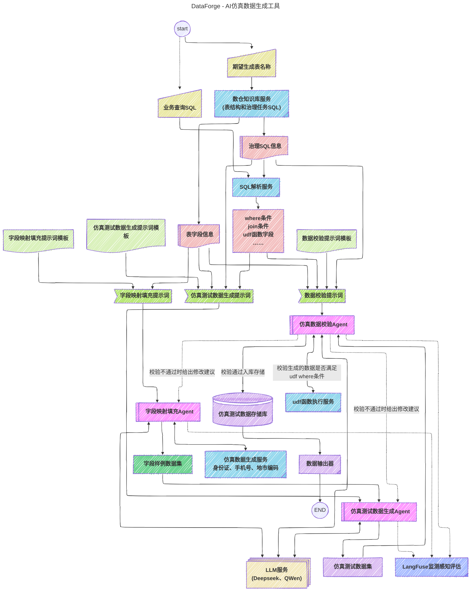

# 数据仿真生成器

## 一图概览

[Meriad在线编辑](https://mermaid.live/edit#pako:eNqdWAtv2lYU_iuWJ0WrBBGEhIA3TQNsOlYCKZB1DybkwuWxGBsZsyxLIjVV0q5ro2ZLu77SJmxrG61aEm1q04W2-S8bNvRf7Fzb2NhASCpFIvY933eOv3se114gs0IOkRTpdDrTvFSSOEQRNCuxYUEsIMJJBCLNxlFrc0u5va-s7bZubSk_rMsHj-XVgzSfFfh8qUCleYLgBGGWIoosn6NFdo7Ht6QiKgMZL4hlllNt2HmhJlEE4mbxJfyoUIIoI_DF5AqoShF5lqsi7TYPkU1zbBZoeCkpiayECvMUEWNSF-KJc5lkZGo6ynyu2WbnsxwKioidLfEFbIstp-I0E83EEzSTSPPqA-Y5YS5bZEWJSNEaMJkKJFIfL1SLbAWCzZZE4HFAqBcRRxFpsiqBcZpc0oyZGD3YFBYNw0hseiaVSQWCUYaiqJkqEiN8pSaFOLZaNRjKLF9jOWcJr3TxKCD25gNN6XZ9R15faz3dtzEnz0dPzdt8eV_-sa5sPW7v_Qr4NEnolNHoVBLY4MfKUxGFbLWLAAyUzTXgSKf592mEKlWEZv-7tHz-AuLPGAFOBxJJJhOKRzPTifjUNKjAwD4FUlgICZUrHGyj7ofQHeWEbJcb-c87yu5z5e62vL8i15_Jq6vKzfXW74ftvTVlp648PBroCjxAzOWKZOMXcrmT8ZuamNSBs5BwwMwWIAutAnEl3imirHQseQDjTOJkAGdthg6kAl8Z5tsHzTfXtQp7--BKmvwa_JXKFUGUWN2nBj7LxN5VVb2Kn19v793uruUebTuBmr5OJutQB1bqcOCcpgIIzMTsAhODFR7kx6azya8pDg7ooHX7hhKre9HDRwf7cOFAs_PcsXTyn3flyzvy4YaFNAFShFLxxBeZJJP4jEkAebwmJZH4LRKtPiS2MECMbrk7Fdo-fNZsvG7vLUOFKteuK5uH8s0D-F_e3JdfXm69-qW1vWzKNUOHM6FPmNC5UwZQy-Xlq69xANeetus3dO8GrSrYFINVi4eSfZiJwdRA2mxstHC_ugKima0HmmKrsaE8WpF_vqH81WitX2k2GrAGTe2M6VptvmoFR2LhOLguI4nt3TRrleB-q5Zk86iuLO-ZbJ_Gg7jpnoZLCw1Adi7Mo_aXxOkEAVz76W_Ko3W7ypgwFI_RkVQkHusbnY1prohEpDysNxsvNIZvhBLffW1sq6aGdvPfS0_gz0jeaCB2diacxJUVZflCuFZFw5-hY9l68BOUhrKype7vSvPVvvk48ZmUOuM65WDU2vHJAiXQfrMhXz2U7-2YZHpSv2OXUVmV7frbP27Y-kvX6YFwOj_qnvjWtVFjEbZJNTX3n-g5LagG1qrpV0mqmTXDiRFLkvamrd1359LInDQ_ZIKDC5tPzGE3t91U52ffoUp8iC3x6QOI-7XC_ig1bnOKdqK2PIpNjN7AR_rNUpXavG9c2mZVzyA_3rDPgvnkg02whX2I4We1pvW7Hge6M3vQ8crm42THgL7EveXYJ7VOt4FYHhtZ_8EPUJudBWvux6IWtDZGW_dX9Ce5uyevP1Ea9faLv6ErEl2tc7F7avbpNvZdti6aHt9eut8-uiqvPoYpp50RFi3HDfue6_hRg6D5ck3jUO68aDXuQQtsHu0qt_6RG4ft3d3Fvuk10luivQcdVSlLO1bv4DcdfnDmjtgiHektYdwUO_OjQ5XFaUWjPGG2aCJf4jjqvbw_78gLvOScQ6VCUaIuClzuAxvIelzWgV6G9vjd4fBQtKVmdHCQYbw-n284uKsqdKjPQ0-6mBNArdO_E3Uo5Ge8Qd9QdOeNTccxPtrjc_tcQ3HG-cAAAuwkQH0SdwQK-twAHQ6zHA90sMvlCYaZicmhYOtLro6mA7R3gvEFetGkgywjscyWciRFLmCuNKl-iUiTuD3lUJ6tcTDH0_wSmLI1SUjO81mSksQacpCiUCsUSUr9COEga5Uc5ARdYgsiW-6YVFj-S0EwLlGuJAnilPYRRf2W4iALIvauMyI-B9sr1HiJpMbGx1UCklogv4PLSf-oy-Oe8LkmvW6v3-uH1XmS8oyN-sf8_kkXmPu8bs_EkoP8XnXpGvWNeTze8XG_d8zjdk363Uv_Awp3lrQ)





## 项目概述
本项目是一个基于数据仓库元数据信息自动生成仿真数据的工具，支持两种表类型：
- ODS(原始数据表)：外部系统接入的原始数据
- ADM(知识库表)：经过治理任务处理的业务数据

通过LLM（大语言模型）技术根据表定义生成符合业务逻辑的测试数据，并保持表间关联关系，为开发和测试提供高质量的数据支持。

## 核心功能
- **元数据驱动**：解析数据仓库的表定义信息（字段名、类型、约束等）
- **智能数据生成**：利用LLM根据字段语义生成合理的仿真数据
- **关联数据构建**：根据表的血缘关系保持数据间的业务逻辑一致性
- **测试支持**：生成的数据可直接用于单元测试、集成测试和开发自测

## 技术特点
1. 采用Python作为主要开发语言
2. 集成大语言模型API进行智能数据生成
3. 支持多种数据源元数据解析
4. 可配置的数据生成规则和关联策略
5. 提供命令行和API两种使用方式
6. 使用uv进行高效的Python依赖管理

## 使用场景
- 开发环境数据准备
- 自动化测试数据生成
- 数据可视化演示
- 系统性能测试

## 快速开始

### 前置条件
- 已安装Python 3.10+
- 已安装uv (可通过`pip install uv`安装)

### 安装与运行
```bash
# 安装项目依赖
uv pip install -e .

# 或开发模式安装(包含测试依赖)
uv pip install -e ".[dev]"

# 运行数据生成
python main.py --metadata /path/to/metadata.json --output /path/to/output
```

### 常用uv命令
```bash
# 更新所有依赖
uv pip install --upgrade -r requirements.txt

# 检查依赖冲突
uv pip check

# 导出依赖列表
uv pip freeze > requirements.txt
```

## 配置说明
在pyproject.toml中配置：
- LLM API密钥
- 数据生成规则
- 关联关系策略
- 输出格式选项


## prompt demo

```
数据库表名称:
fmdbmeta.NB_APP_EVIDENCE_EMAILRELATE
期望条件：
fmdbmeta.NB_APP_EVIDENCE_EMAILRELATE:
1. CERTIFICATE_CODE is not null AND MSISDN like '139%' and AGE <100 and SEXCODE is not null
2. CERTIFICATE_CODE身份证号码要和AGE年龄、SEXCODE性别逻辑匹配
期望生成数据条数:
fmdbmeta.NB_APP_EVIDENCE_EMAILRELATE: 5
```


```
数据库表名称:
fmdbmeta.NB_APP_EVIDENCE_EMAILRELATE
期望生成数据条数:
fmdbmeta.NB_APP_EVIDENCE_EMAILRELATE: 5
```