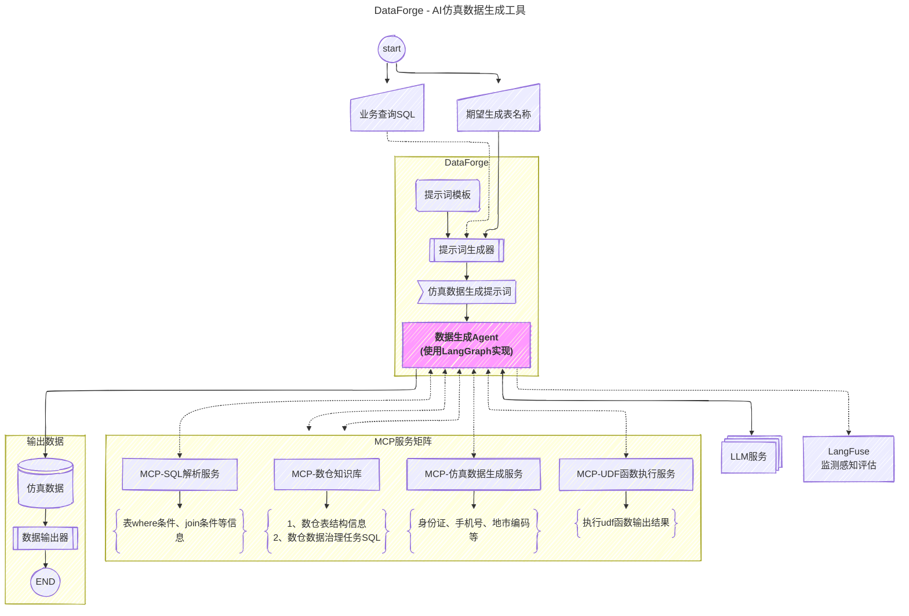

# 数据仿真生成器

## 一图概览

[Meriad在线编辑](https://mermaid.live/edit#pako:eNqFVX9v20QY_iqnQ0KbFFdJmjaNQWhZkmbdkqw05R_qCV3si2Pq3EWOrS5ElSgqG2WUFXUgYFlDgKlFiLVCGp2alX4YYjt8C85nx0nXdfyRH--v533e51772lCmCoYiFARBIqZm6lgEWWSieWqoGAggvTDon7mdrvPtkbP9zH3Udb7YsY-f2p8fS0SmpKqpokQA0CldFUENESVroDXiucwarjMwQo060nkOalHLFAHWVz2T_fBSAOqY9copKm6KoIr0JvbdhDFb1JHMYIhZNg1kYrUlgsJCKZde-qicyxdzpeWyRDj1qk7X5BoyTLCc9cvLy-ml5WvtZg01GA1ZM2QdRxiJCtZFIMGmyZIluO4n50rZy1NZMExMX2uDIK9iMG7NibzYP59uMJ0G_d1h78Dt7zp7m4OznrNxKEkkHsZ8JZ0_--7OvUG_b3_ZK79fkCAIGlwPeVzAH578PuifDg83PKytB07nxH54zP7bnSP7xWfuy-_cnzbcP7bGWJkQq46IhXRBIw3LnEAcvPiR9Xe6T4eHP59jkf2_SoetROexvw9sWntn290_Gsv5BpVY9loNG9h50hv0_2L0P6Ya8Q1GPhAsJDJ_xXm44_56Mjzcdg56zpOzq74_Hxu3oIoyOdOFfQ0RxrD5lZXQGyz1Dwd37vjBG-HwDYPKY-6FQtHpbDPBApAFURQbGlnN6KjZHNMxsHxOqQkmaZWtsl98ZXB65j46KCCi5g3UqNnP9tyvj66OKd5cKWYWhddMwykEVG_xJH-xXO8Y79knu0GswGMfZOft-6cewNb-sPfVuerbPIMd_HD_F2fvPHIxFEHXiCC39EskDs-8xCTlnuHfu_b9kwk9F1ck6M05b40ebffxN87zB85ml3PeHLxkqxMkL12-__4EllL1B_L78Oes48s28eADQXgPZMDbIHgbZIAwxTz5YL15ODCaVkX1TmD83gtWbzIp7xsx_rPg-zBRRj1DDAkySX0h3e5v_37_XILBsoB3OYObjNMt9imwz23vf3CQHDgdnAs3csExcmMpWApuXH9Tf1-W0eGMmntlRf5d8sFL2QsgHkUWuhHWeHwXR1HZ2_IsroJw5UFV03XxrWqqGqlSYgprWFNrplihuvLOKzVavUENExFzshBXZpXZ19TCCGRXQh1pCruY2h6SBPltIkFvDRRcRZZuerOts1RkmbTcIjIUTcPCEWhQS62NDKuhsGsjqyGmTn3kbCDyIaWhiRXNpEbRvwf5dRiBquE1DwCZRNjIUIuYUIwneT0U2_CuZ8WmEsnUTCqRnE7GYzPTiQhsQXEmNRVNTidic4l4NB6PpdYj8BPeMDqVnE3GZ-amE7PRuWhybv0_Xxzu2w)



## 项目概述
本项目是一个基于数据仓库元数据信息自动生成仿真数据的工具，支持两种表类型：
- ODS(原始数据表)：外部系统接入的原始数据
- ADM(知识库表)：经过治理任务处理的业务数据

通过LLM（大语言模型）技术根据表定义生成符合业务逻辑的测试数据，并保持表间关联关系，为开发和测试提供高质量的数据支持。

## 核心功能
- **元数据驱动**：解析数据仓库的表定义信息（字段名、类型、约束等）
- **智能数据生成**：利用LLM根据字段语义生成合理的仿真数据
- **关联数据构建**：根据表的血缘关系保持数据间的业务逻辑一致性
- **测试支持**：生成的数据可直接用于单元测试、集成测试和开发自测

## 技术特点
1. 采用Python作为主要开发语言
2. 集成大语言模型API进行智能数据生成
3. 支持多种数据源元数据解析
4. 可配置的数据生成规则和关联策略
5. 提供命令行和API两种使用方式
6. 使用uv进行高效的Python依赖管理

## 使用场景
- 开发环境数据准备
- 自动化测试数据生成
- 数据可视化演示
- 系统性能测试

## 快速开始

### 前置条件
- 已安装Python 3.10+
- 已安装uv (可通过`pip install uv`安装)

### 安装与运行
```bash
# 安装项目依赖
uv pip install -e .

# 或开发模式安装(包含测试依赖)
uv pip install -e ".[dev]"

# 运行数据生成
python main.py --metadata /path/to/metadata.json --output /path/to/output
```

### 常用uv命令
```bash
# 更新所有依赖
uv pip install --upgrade -r requirements.txt

# 检查依赖冲突
uv pip check

# 导出依赖列表
uv pip freeze > requirements.txt
```

## 配置说明
在pyproject.toml中配置：
- LLM API密钥
- 数据生成规则
- 关联关系策略
- 输出格式选项
