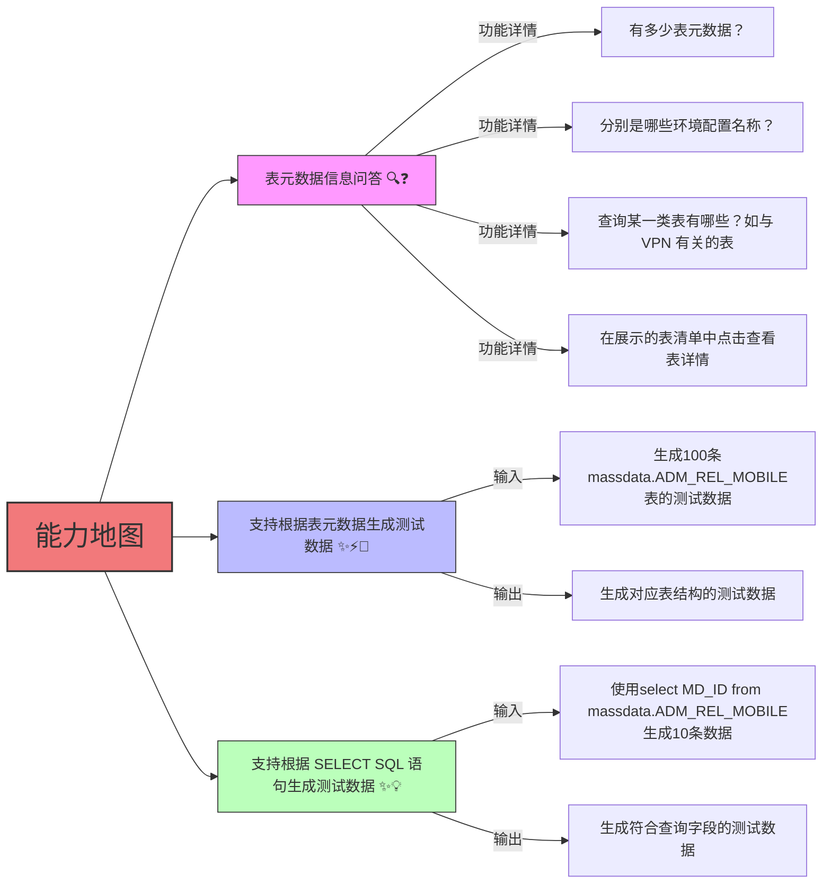
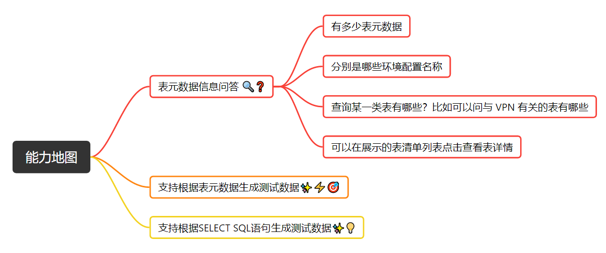
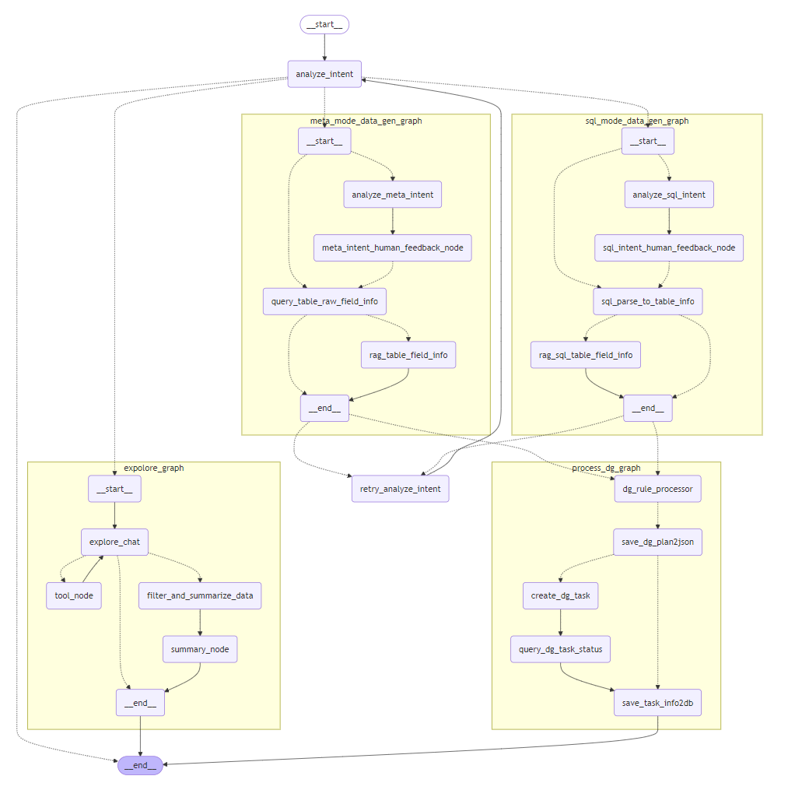
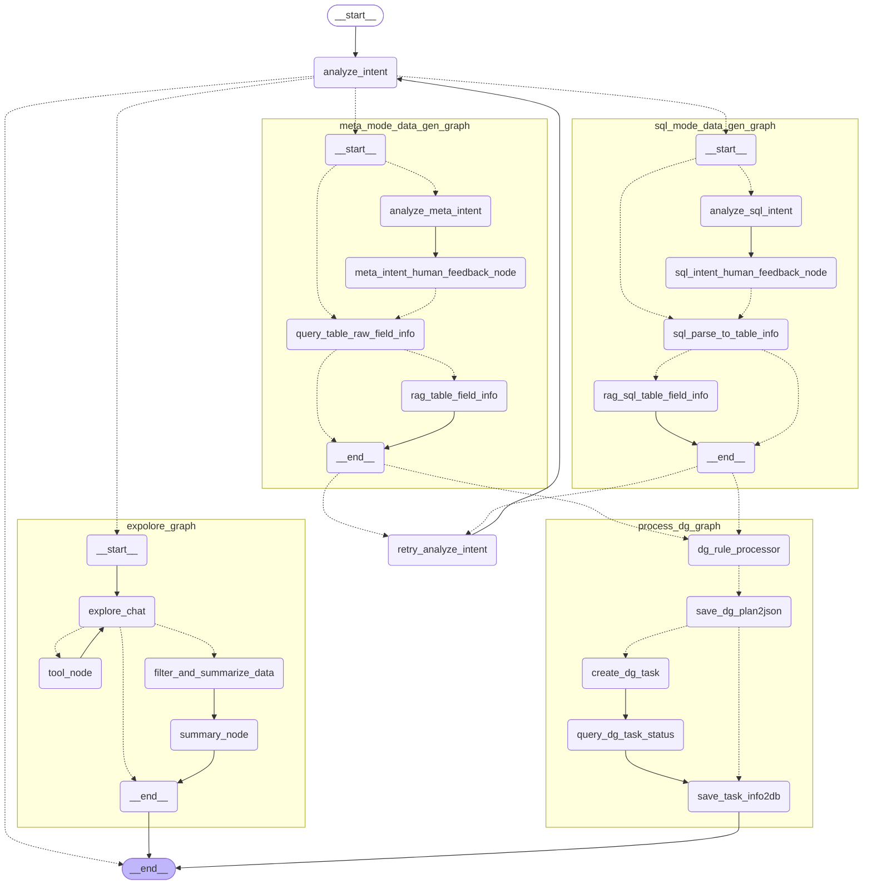

# 欢迎使用 AI 测试数据生成助手

## 能力地图

```mermaid
flowchart LR
    START[能力地图] --> A & B & C
    A[表元数据信息问答 🔍❓]
    A -->|功能详情| A1[有多少表元数据？]
    A -->|功能详情| A2[分别是哪些环境配置名称？]
    A -->|功能详情| A3[查询某一类表有哪些？如与 VPN 有关的表]
    A -->|功能详情| A4[在展示的表清单中点击查看表详情]

    B[支持根据表元数据生成测试数据 ✨⚡🎯]
    B -->|输入| B1[生成100条massdata.ADM_REL_MOBILE表的测试数据]
    B -->|输出| B2[生成对应表结构的测试数据]

    C[支持根据 SELECT SQL 语句生成测试数据 ✨💡]
    C -->|输入| C1[使用select MD_ID from massdata.ADM_REL_MOBILE生成10条数据]
    C -->|输出| C2[生成符合查询字段的测试数据]


    style START fill:#f2797b,stroke:#333,stroke-width:2px,font-size:30px
    style A fill:#f9f,stroke:#333,stroke-width:1px
    style B fill:#bbf,stroke:#333,stroke-width:1px
    style C fill:#bfb,stroke:#333,stroke-width:1px

```

<!--  -->

## 核心节点流程图

<!--  -->

```mermaid
graph TD;
        __start__([<p>__start__</p>]):::first
        analyze_intent(analyze_intent)
        retry_analyze_intent(retry_analyze_intent)
        __end__([<p>__end__</p>]):::last
        __start__ --> analyze_intent;
        analyze_intent -.-> expolore_graph___start__;
        analyze_intent -.-> meta_mode_data_gen_graph___start__;
        analyze_intent -.-> sql_mode_data_gen_graph___start__;
        meta_mode_data_gen_graph___end__ -.-> process_dg_graph_dg_rule_processor;
        meta_mode_data_gen_graph___end__ -.-> retry_analyze_intent;
        retry_analyze_intent --> analyze_intent;
        sql_mode_data_gen_graph___end__ -.-> process_dg_graph_dg_rule_processor;
        sql_mode_data_gen_graph___end__ -.-> retry_analyze_intent;
        analyze_intent -.-> __end__;
        expolore_graph___end__ --> __end__;
        process_dg_graph_save_task_info2db --> __end__;
        subgraph expolore_graph
        expolore_graph___start__(<p>__start__</p>)
        expolore_graph_tool_node(tool_node)
        expolore_graph_explore_chat(explore_chat)
        expolore_graph_filter_and_summarize_data(filter_and_summarize_data)
        expolore_graph_summary_node(summary_node)
        expolore_graph___end__(<p>__end__</p>)
        expolore_graph___start__ --> expolore_graph_explore_chat;
        expolore_graph_explore_chat -.-> expolore_graph_filter_and_summarize_data;
        expolore_graph_explore_chat -.-> expolore_graph_tool_node;
        expolore_graph_filter_and_summarize_data --> expolore_graph_summary_node;
        expolore_graph_tool_node --> expolore_graph_explore_chat;
        expolore_graph_explore_chat -.-> expolore_graph___end__;
        expolore_graph_summary_node --> expolore_graph___end__;
        end
        subgraph meta_mode_data_gen_graph
        meta_mode_data_gen_graph___start__(<p>__start__</p>)
        meta_mode_data_gen_graph_analyze_meta_intent(analyze_meta_intent)
        meta_mode_data_gen_graph_meta_intent_human_feedback_node(meta_intent_human_feedback_node)
        meta_mode_data_gen_graph_query_table_raw_field_info(query_table_raw_field_info)
        meta_mode_data_gen_graph_rag_table_field_info(rag_table_field_info)
        meta_mode_data_gen_graph___end__(<p>__end__</p>)
        meta_mode_data_gen_graph___start__ -.-> meta_mode_data_gen_graph_analyze_meta_intent;
        meta_mode_data_gen_graph___start__ -.-> meta_mode_data_gen_graph_query_table_raw_field_info;
        meta_mode_data_gen_graph_analyze_meta_intent --> meta_mode_data_gen_graph_meta_intent_human_feedback_node;
        meta_mode_data_gen_graph_meta_intent_human_feedback_node -.-> meta_mode_data_gen_graph_query_table_raw_field_info;
        meta_mode_data_gen_graph_query_table_raw_field_info -.-> meta_mode_data_gen_graph_rag_table_field_info;
        meta_mode_data_gen_graph_query_table_raw_field_info -.-> meta_mode_data_gen_graph___end__;
        meta_mode_data_gen_graph_rag_table_field_info --> meta_mode_data_gen_graph___end__;
        end
        subgraph sql_mode_data_gen_graph
        sql_mode_data_gen_graph___start__(<p>__start__</p>)
        sql_mode_data_gen_graph_analyze_sql_intent(analyze_sql_intent)
        sql_mode_data_gen_graph_sql_intent_human_feedback_node(sql_intent_human_feedback_node)
        sql_mode_data_gen_graph_sql_parse_to_table_info(sql_parse_to_table_info)
        sql_mode_data_gen_graph_rag_sql_table_field_info(rag_sql_table_field_info)
        sql_mode_data_gen_graph___end__(<p>__end__</p>)
        sql_mode_data_gen_graph___start__ -.-> sql_mode_data_gen_graph_analyze_sql_intent;
        sql_mode_data_gen_graph___start__ -.-> sql_mode_data_gen_graph_sql_parse_to_table_info;
        sql_mode_data_gen_graph_analyze_sql_intent --> sql_mode_data_gen_graph_sql_intent_human_feedback_node;
        sql_mode_data_gen_graph_sql_intent_human_feedback_node -.-> sql_mode_data_gen_graph_sql_parse_to_table_info;
        sql_mode_data_gen_graph_sql_parse_to_table_info -.-> sql_mode_data_gen_graph_rag_sql_table_field_info;
        sql_mode_data_gen_graph_rag_sql_table_field_info --> sql_mode_data_gen_graph___end__;
        sql_mode_data_gen_graph_sql_parse_to_table_info -.-> sql_mode_data_gen_graph___end__;
        end
        subgraph process_dg_graph
        process_dg_graph_dg_rule_processor(dg_rule_processor)
        process_dg_graph_save_dg_plan2json(save_dg_plan2json)
        process_dg_graph_create_dg_task(create_dg_task)
        process_dg_graph_query_dg_task_status(query_dg_task_status)
        process_dg_graph_save_task_info2db(save_task_info2db)
        process_dg_graph_create_dg_task --> process_dg_graph_query_dg_task_status;
        process_dg_graph_dg_rule_processor -.-> process_dg_graph_save_dg_plan2json;
        process_dg_graph_query_dg_task_status --> process_dg_graph_save_task_info2db;
        process_dg_graph_save_dg_plan2json -.-> process_dg_graph_create_dg_task;
        process_dg_graph_save_dg_plan2json -.-> process_dg_graph_save_task_info2db;
        end
        classDef default fill:#f2f0ff,line-height:1.2
        classDef first fill-opacity:0
        classDef last fill:#bfb6fc
```
