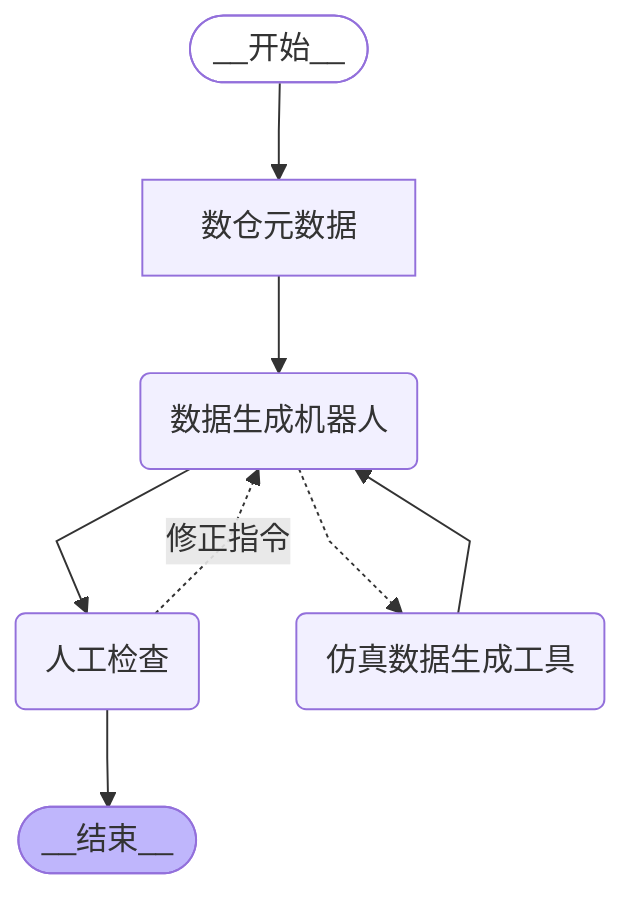
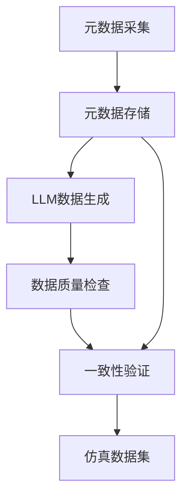

# 基于数据仓库的元数据定义解析与仿真数据生成设计




## 1. 元数据定义解析

### 1.1 元数据采集
- 从数据仓库提取完整元数据，包括表类型定义：
  - ODS(原始数据表)：外部系统接入的原始数据
    * 特征：保留原始字段结构和数据格式
    * 用途：作为数据加工的输入源
  - ADM(知识库表)：经过治理任务处理的业务数据
    * 特征：按业务领域组织，经过清洗转换
    * 用途：支持业务分析和应用

- 通用元数据信息：
  - 表级信息：数据分类、中英文名称、业务描述
  - 字段级信息：
    * 技术属性：英文名、数据类型、必填约束
    * 业务属性：中文名、数据分类、字典类型
    * 描述信息：用途备注、业务规则说明
  - 索引信息：主键、外键、业务唯一键
  - 血缘关系：上游数据源、下游消费表
- 示例字段元数据结构：
  ```json
  {
    "field_name": "customer_type",
    "data_type": "varchar(20)",
    "required": true,
    "zh_name": "客户类型",
    "category": "基础属性",
    "dict_type": "customer_type_dict",
    "comment": "区分个人客户和企业客户"
  }
  ```

### 1.2 元数据标准化

- 建立统一元数据模型，包含：
  - 技术元数据(字段类型、约束等)
  - 业务元数据(字段含义、业务规则)
- 对异构数据源元数据进行标准化转换

### 1.3 元数据存储
- 使用图数据库存储表与字段的关联关系
- 建立元数据版本管理机制
- 实现元数据变更的追溯能力

## 2. LLM驱动的仿真数据生成

### 2.1 语义理解
- 综合使用字段各类元数据构建LLM上下文：
  - 基础提示：字段中英文名称+数据类型+必填约束
  - 业务上下文：数据分类+字典类型+用途备注
- 增强型提示模板：
  ```
  请作为数据专家生成符合以下业务场景的示例数据：
  字段中文名：{zh_name} ({field_name})
  数据类型：{data_type}{required? " (必填)":""}
  业务分类：{category}
  字典类型：{dict_type || "无"}
  业务规则：{comment}

  生成要求：
  1. 符合{dict_type}字典约束（如适用）
  2. 体现{category}分类特征
  3. 遵守{comment}中的业务规则
  ```

### 2.2 数据生成
- 采用few-shot prompting提供示例
- 集成数据治理任务中的SQL规则(使用sqlglot解析sql提取查询条件、返回值、udf函数等)：
  - 应用WHERE条件过滤不符合条件的数据
  - 遵循JOIN条件维护表间关联关系
  - 执行字段转换表达式(如类型转换、计算等)
- 对生成结果进行格式和业务规则校验
- 实现生成参数的动态调整：
  - 数值范围控制(符合SQL中的比较条件)
  - 枚举值分布(符合SQL中的IN条件)
  - 字符串模式匹配(符合SQL中的LIKE条件)
- 示例：对于治理任务SQL"SELECT age*2 AS double_age FROM user WHERE age>18"，
  生成数据时会确保：
  1. 所有age值大于18
  2. double_age字段值为age的两倍

### 2.3 质量评估
- 建立数据合理性评估指标
- 实现生成数据的自动验证
- 支持人工反馈闭环优化

## 3. 基于血缘关系的数据一致性保障

### 3.1 血缘分析
- 基于数仓提供的血缘关系构建数据拓扑图：
  - 表级血缘：追踪数据从源系统到核心层的完整链路
  - 字段级血缘：标记关键字段的加工转换过程
- 应用场景：
  - 识别核心业务实体（如客户、订单）的完整加工链路
  - 确保衍生指标（如GMV、DAU）的计算口径一致
  - 验证枚举值（如状态字段）的合法转换路径

### 3.2 数据治理任务
- 实现ODS到ADM表的数据转换：
  - 输入表：一个或多个ODS源数据表
  - 输出表：ADM结果数据表
  - 处理逻辑：SQL脚本，包含以下典型操作：
    * 数据清洗（去重、标准化）
    * 字段转换（计算、格式化）
    * 业务规则应用
    * 多表关联整合
- 任务元数据结构示例：
  ```json
  {
    "task_id": "etl_user_profile",
    "name": "用户画像ETL任务",
    "input_tables": ["user", "order", "payment"],
    "output_table": "user_profile",
    "sql": "SELECT u.user_id, u.username, ...",
    "schedule": "daily",
    "owner": "data_team"
  }
  ```
- 血缘关系建立规则：
  - 通过解析SQL识别表间关系
  - 跟踪字段级的数据流转和转换
  - 记录数据处理逻辑和业务规则

### 3.3 一致性规则
- 主外键关联数据的一致性约束
- 指标计算口径的统一性
- 时间维度的对齐要求
- 业务状态流转的合理性

### 3.4 实现机制
- 在数据生成阶段注入关联约束
- 采用有状态生成保障流程一致性
- 实现跨表数据的联合采样
- 建立数据一致性检查规则库

## 4. 系统架构设计



## 5. 实施路线

1. 元数据采集阶段（2周）：
   - 开发数仓元数据连接器
   - 实现元数据标准化转换
   - 构建基础血缘图谱

2. 单表生成阶段（3周）：
   - 实现基础字段类型生成
   - 集成字典类型约束
   - 开发数据质量校验规则

3. 跨表协调阶段（4周）：
   - 实现主外键关联生成
   - 开发业务状态机验证
   - 构建数据一致性检查器

4. 系统优化阶段（持续）：
   - LLM提示工程优化
   - 血缘关系可视化
   - 性能调优